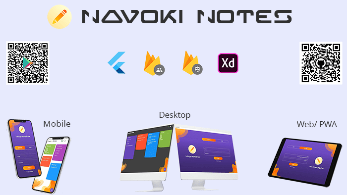

# NavokiNotes

Navoki Notes, a POC (proof of concept) note app app, will sync data to cloud and on all devices. Build for **Android, iOS, Web App, PWA, Windows, macOS, Linux** , so you can access data anywhere on any device. Its FREE to use.
The is a **single code-base cross-platform app made on Flutter Framework with Firebase**.

[](https://opensource.org/licenses/Apache-2.0) 
[](https://codemagic.io/apps/62090b75546bd24402e57cd4/62090b75546bd24402e57cd3/latest_build)
<!-- [](https://snapcraft.io/navoki-notes) -->

<!-- [](https://play.google.com/store/apps/details?id=com.navoki.keepapp)  [](https://snapcraft.io/navoki-notes) -->

 [Youtube](https://www.youtube.com/channel/UCP2-MYtIbBnlEcfTvJKo5Og?sub_confirmation=1)

 [Navoki.com](https://navoki.com/blog/)


## Screenshots

       

## Video
[](https://www.youtube.com/watch?v=g-hPh6FPfgo)

<!-- ## Downloads
Ready to use app [Android App](https://play.google.com/store/apps/details?id=com.navoki.keepapp)

[Web App](https://navoki.com/samples/navoki-notes/#/)

[iOS, Windows, MacOS,Linux](https://github.com/theshivamlko/navoki_notes/releases) -->

## Getting Started

This project is made with 
- [Flutter Framework](https://www.flutter.dev)
- [Firebase REST API](https://firebase.google.com/docs/projects/api/reference/rest)
- [Firebase Authentication](https://firebase.google.com/docs/auth/)
- [Cloud Firestore](https://firebase.google.com/docs/firestore)
- [Adobe XD Flutter plugin](https://xd.adobelanding.com/xd-to-flutter/).

A few resources to get you started if this is your first Flutter project:

- [Lab: Write your first Flutter app](https://flutter.dev/docs/get-started/codelab)
- [Cookbook: Useful Flutter samples](https://flutter.dev/docs/cookbook)

For help getting started with Flutter, view our
[online documentation](https://flutter.dev/docs), which offers tutorials,
samples, guidance on mobile development, and a full API reference.

## Codemagic Build and Release supported

## Installation and Config
- Install [Flutter SDK](https://flutter.dev/docs/get-started/install) from official site.
- Setup Environment for [Android](https://flutter.dev/docs/get-started/flutter-for/android-devs) and [iOS](https://flutter.dev/docs/get-started/flutter-for/ios-devs)
- Setup Environment for [Web](https://www.youtube.com/watch?v=N8YYVV1aZc8)
- Setup Environment for [Desktop](https://www.youtube.com/watch?v=ixj0MMusDM8)
- Create a [Firebase Project](https://firebase.google.com/) 
- Enable [Firebase Security rules](https://firebase.google.com/docs/firestore/security/get-started) on Firebase Console. [Read more](https://medium.com/@khreniak/cloud-firestore-security-rules-basics-fac6b6bea18e).
- Check if platform is shows for project by running ```flutter devices```
- Replace `API_KEY` value with your project key, `<Project>` _**-> Project Settings -> General ->**_ `Web API key`
- Add you key in `AppConstants.dart`
```
  // TODO: Replace your key here
  static const String API_KEY = "";
```

## Build Project
- To run and build project run command `flutter build <device-name>`
- To get devices list, run `flutter devices`

### NOTE:
- You need SDK setup only, then can create your own build for each platform.
- **Publishing Apps** still need to be tested for stability after release on Desktop apps 
- There will be security risk with API key, I am working on it.

## Learning
Few things I have used that you can work to understand flutter development.
- Simple app state management
- Using RestAPI
- Firebase Auth and Cloud Firestore using Rest API
- Staggered View
- Local Storage

You can build your own project on this just by changing dart code in `lib` folder.


### My Flutter and Tools version:
```flutter doctor -v```
```
[√] Flutter (Channel stable, 2.10.1, on Microsoft Windows [Version 10.0.22000.526], locale en-IN)
    • Flutter version 2.10.1 at C:\Users\TheDoctor\flutter
    • Upstream repository https://github.com/flutter/flutter.git
    • Framework revision db747aa133 (5 days ago), 2022-02-09 13:57:35 -0600
    • Engine revision ab46186b24
    • Dart version 2.16.1
    • DevTools version 2.9.2

[!] Android toolchain - develop for Android devices (Android SDK version 32.1.0-rc1)
    • Android SDK at C:\Users\TheDoctor\AppData\Local\Android\Sdk
    • Platform android-32, build-tools 32.1.0-rc1
    • ANDROID_HOME = C:\Users\TheDoctor\AppData\Local\Android\Sdk
    • Java binary at: C:\Program Files\Android\Android Studio\jre\bin\java
    • Java version OpenJDK Runtime Environment (build 11.0.11+9-b60-7590822)
    ! Some Android licenses not accepted.  To resolve this, run: flutter doctor --android-licenses

[√] Chrome - develop for the web
    • Chrome at C:\Program Files\Google\Chrome\Application\chrome.exe

[√] Visual Studio - develop for Windows (Visual Studio Community 2022 17.0.6)
    • Visual Studio at C:\Program Files\Microsoft Visual Studio\2022\Community
    • Visual Studio Community 2022 version 17.0.32126.317
    • Windows 10 SDK version 10.0.22000.0

[√] Android Studio (version 2021.1)
    • Android Studio at C:\Program Files\Android\Android Studio
    • Flutter plugin can be installed from:
       https://plugins.jetbrains.com/plugin/9212-flutter
    • Dart plugin can be installed from:
       https://plugins.jetbrains.com/plugin/6351-dart
    • Java version OpenJDK Runtime Environment (build 11.0.11+9-b60-7590822)

[√] IntelliJ IDEA Ultimate Edition (version 2020.1)
    • IntelliJ at G:\Program Files\IntelliJ IDEA 2020.1
    • Flutter plugin version 46.0.3
    • Dart plugin version 201.7223.43

[√] VS Code (version 1.63.2)
    • VS Code at C:\Users\TheDoctor\AppData\Local\Programs\Microsoft VS Code
    • Flutter extension version 3.34.0

[√] Connected device (4 available)
    • ONEPLUS A6010 (mobile) • 64519b22 • android-arm64  • Android 11 (API 30)
    • Windows (desktop)      • windows  • windows-x64    • Microsoft Windows [Version 10.0.22000.526]
    • Chrome (web)           • chrome   • web-javascript • Google Chrome 98.0.4758.82
    • Edge (web)             • edge     • web-javascript • Microsoft Edge 98.0.1108.43

[√] HTTP Host Availability
    • All required HTTP hosts are available

```

## Contribution
This project is open to all kinds of contribution in all of its categories.You can add more features and bug fixes in this code.
**DO NOT** send PR for rename of file and variables, formatting code or other low-quality changes. **Focus on making this BIGGER!**

## Support
If you found this project helpful then show some support by :star: the repo and subscribe to my YoutubeChannel and Newsletter for latest updates in dev world. It will **encourage** me to make more videos and tutorials.
Comment on youtube channel for more tutorials
 
## Project Created & Maintained By
#### SHIVAM SRIVASTAVA
Mobile Solution Architect, #Android and #Flutter Developer, #Dart, Maybe #Go, #Founder of Navoki.com, #Google Scholar #Udacity Android #Nanodegree, 
 Entrepreneur
 
 [](https://www.youtube.com/channel/UCP2-MYtIbBnlEcfTvJKo5Og?sub_confirmation=1)  &nbsp; [](https://twitter.com/theshivamlko) &nbsp; [](https://www.linkedin.com/in/theshivamlko/) &nbsp; [](https://navoki.com/) &nbsp; [](https://www.instagram.com/navokitech)  
 

## License and Trademarks
```
Copyright 2020 Shivam Srivastava

Licensed under the Apache License, Version 2.0 (the "License");
you may not use this file except in compliance with the License.
You may obtain a copy of the License at

    http://www.apache.org/licenses/LICENSE-2.0

Unless required by applicable law or agreed to in writing, software
distributed under the License is distributed on an "AS IS" BASIS,
WITHOUT WARRANTIES OR CONDITIONS OF ANY KIND, either express or implied.
See the License for the specific language governing permissions and
limitations under the License.
```
